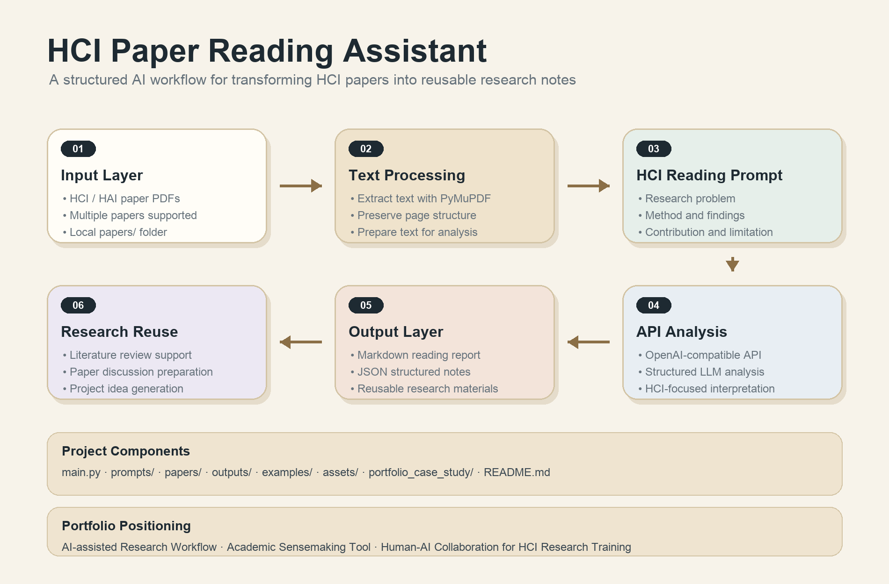

# HCI Paper Reading Assistant

An API-based workflow that transforms HCI papers into structured research notes for academic sensemaking.

This project helps early-stage HCI learners read academic papers more systematically. It extracts text from PDF papers and uses an OpenAI-compatible API to generate structured reading reports covering research problems, research questions, methods, findings, contributions, limitations, and possible replication ideas.



## 1. Project Motivation

Reading HCI papers can be challenging for beginners because papers often combine theoretical framing, empirical methods, design implications, and implicit research contributions.

Generic paper summaries are often not enough for research training. For HCI learners, it is more useful to understand a paper through research-oriented dimensions such as:

- What problem does the paper address?
- Why does the problem matter in HCI?
- What research questions guide the study?
- What methods are used?
- What are the main findings?
- What contributions does the paper make?
- How can the paper inspire future research or small projects?

This project explores how large language models can support academic sensemaking by turning unstructured academic PDFs into reusable structured research notes.

## 2. What This Project Does

The assistant takes one or more HCI paper PDFs as input and generates:

- A Markdown reading report
- A JSON structured note file
- HCI-specific analysis sections
- Literature-review style sentences
- Replication or extension ideas for future projects

The current version supports batch processing of multiple PDF files.

## 3. Key Features

- PDF text extraction with PyMuPDF
- HCI-specific prompt template
- OpenAI-compatible API integration
- Batch processing for multiple papers
- Markdown report generation
- JSON structured note export
- Example output for portfolio demonstration

## 4. Output Sections

Each generated reading report includes:

1. Basic information  
2. One-sentence summary  
3. Research problem  
4. Research questions  
5. Theoretical background and key concepts  
6. Methodology  
7. Main findings  
8. Contributions  
9. Limitations  
10. Relevance to Human-AI Interaction  
11. Ideas for replication or extension  
12. Sentences useful for literature review  
13. Personal reflection questions  

## 5. Project Structure

```text
hci-paper-reading-assistant/
├── main.py
├── README.md
├── requirements.txt
├── .env.example
├── .gitignore
├── prompts/
│   └── paper_reading_prompt.txt
├── papers/
│   └── input PDF papers
├── outputs/
│   └── generated local reports
├── examples/
│   └── sample_reading_report.md
├── assets/
│   ├── generate_workflow.py
│   └── workflow.png
└── portfolio_case_study/
    └── case_study.md
```

## 6. Installation

Create and activate a virtual environment:

```bash
python3 -m venv .venv
source .venv/bin/activate
```

Install dependencies:

```bash
pip install -r requirements.txt
```

## 7. Environment Variables

Create a `.env` file in the project root:

```env
OPENAI_API_KEY=your_api_key_here
OPENAI_BASE_URL=your_base_url_here
OPENAI_MODEL=your_model_name_here
```

For OpenAI-compatible API providers, set `OPENAI_BASE_URL` to the provider's API endpoint.

A template is provided in:

```text
.env.example
```

## 8. Usage

Put one or more PDF papers into the `papers/` folder:

```text
papers/
├── paper_1.pdf
└── paper_2.pdf
```

Run the assistant:

```bash
python main.py
```

The generated files will be saved in the `outputs/` folder:

```text
outputs/
├── paper_1_reading_report.md
├── paper_1_structured_notes.json
├── paper_2_reading_report.md
└── paper_2_structured_notes.json
```

## 9. Example Output

A sample generated reading report is available here:

```text
examples/sample_reading_report.md
```

This sample demonstrates how the assistant organizes an HCI paper into research-oriented reading notes.

## 10. Technical Implementation

This project uses:

- Python for workflow scripting
- PyMuPDF for PDF text extraction
- python-dotenv for local environment configuration
- OpenAI-compatible API for language model analysis
- Markdown for readable research reports
- JSON for structured note export

The core workflow is implemented in `main.py`, while the HCI-specific reading framework is defined in `prompts/paper_reading_prompt.txt`.

## 11. Portfolio Relevance

This project can be positioned as:

**AI-assisted Research Workflow / Academic Sensemaking Tool / Human-AI Collaboration for HCI Research Training**

It demonstrates:

- API-based AI application prototyping
- Prompt design for research tasks
- PDF-to-structured-notes workflow development
- HCI-oriented problem framing
- Human-AI Interaction project thinking
- Academic workflow design

## 12. Current Limitations

The current version is a working prototype and has several limitations:

- PDF extraction quality depends on the formatting of the original paper.
- Long papers are handled with simple text truncation.
- The system does not yet support citation-level extraction.
- The system does not yet compare multiple papers across themes.
- Generated reports still require human review and interpretation.
- The current version does not include a graphical user interface.

## 13. Future Improvements

Potential future improvements include:

- Multi-paper comparison
- Literature review synthesis
- Research gap detection
- Paper clustering by topic
- Better long-document chunking
- Citation-aware extraction
- Streamlit-based interface
- Export to Notion, Zotero notes, or Markdown knowledge bases

## 14. Example Use Cases

This assistant can be used for:

- Preparing for HCI paper discussions
- Building structured literature review notes
- Identifying research problems and methods
- Generating early-stage project ideas
- Supporting Human-AI Interaction research training

## 15. Repository Notes

The repository does not include private API keys or copyrighted PDF papers.

Local files such as `.env`, `.venv/`, `papers/`, and `outputs/` are excluded through `.gitignore`.